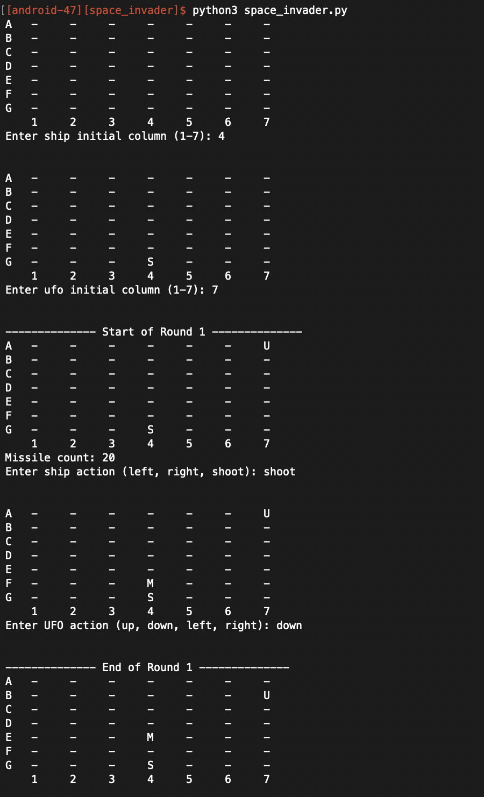
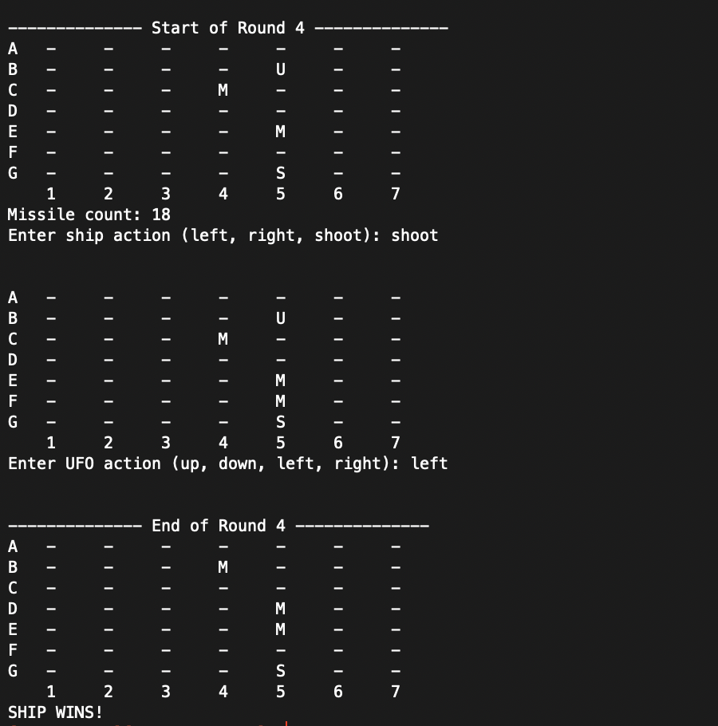

# Space Invader Board Game

Author: Javier Garcia Ramirez (android-47)
Updated on: Mar 25, 2021

### FEATURES
* 7x7 board
* User(s) place Ship and UFO
* Ship is moved or missile is placed on board based on user input
* UFO is moved based on user input
* Missiles are updated (move up 1 row and off of board if top row) at the end of each round
* Player is accurately declared the winner
* Game board is updated and displayed each round
* Error handles ALL bad input by displaying error message and prompting the user again

## GAMEPLAY
### Start of Game

### End of game


### DESCRIPTION
Setup: 7 x 7 board, Player 1 is the UFO, Player 2 is the ship and starts with 20 missiles

UFO: if there is room available, it can move left, right, up, or down and it's objective is to land on the bottom row or directly above the ship. The 

Ship: has 20 missiles, can shoot 1 missile per round OR move left or right, if there is room and it's objective is to hit the UFO with a missile. At the end of each round, the all missiles move up one row.

### STEPS ON HOW TO RUN THE PROGRAM
1. Enter the following line on the terminal command line:    


```
python3 space_invader.py
```